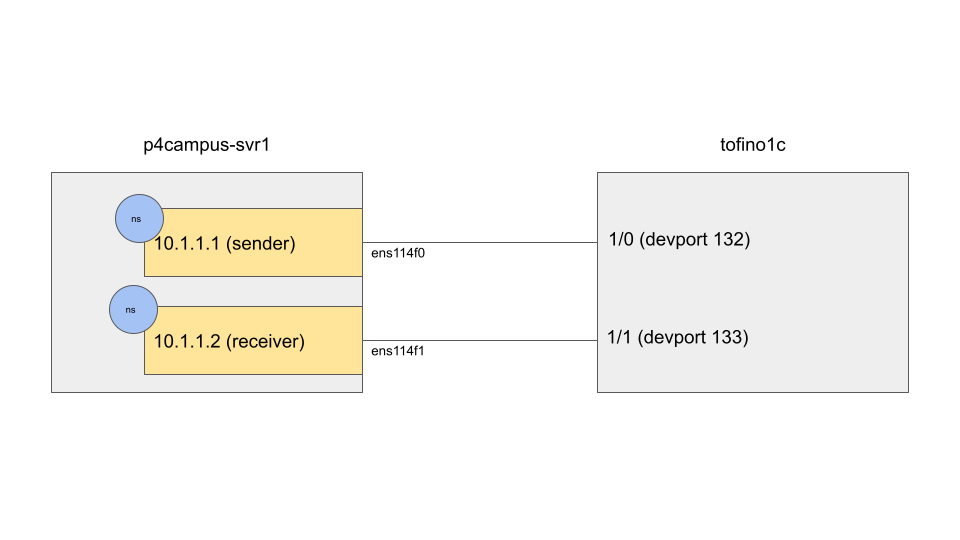

# inNetworkCC

## Setup and Software
As of 2023-06-19:

* **SDE:** 9.7.1
* **DPDK:** 19.11.14
* **Pcap++ (on Switch):** 22.11
* **Pcap++ (on Server):** 21.05 (with modifications for inNetworkCC Header found [here](https://github.com/NUS-SNL/PcapPlusPlus/tree/f857878770a5cacdb2e3c44982cbfe7766a66745))
